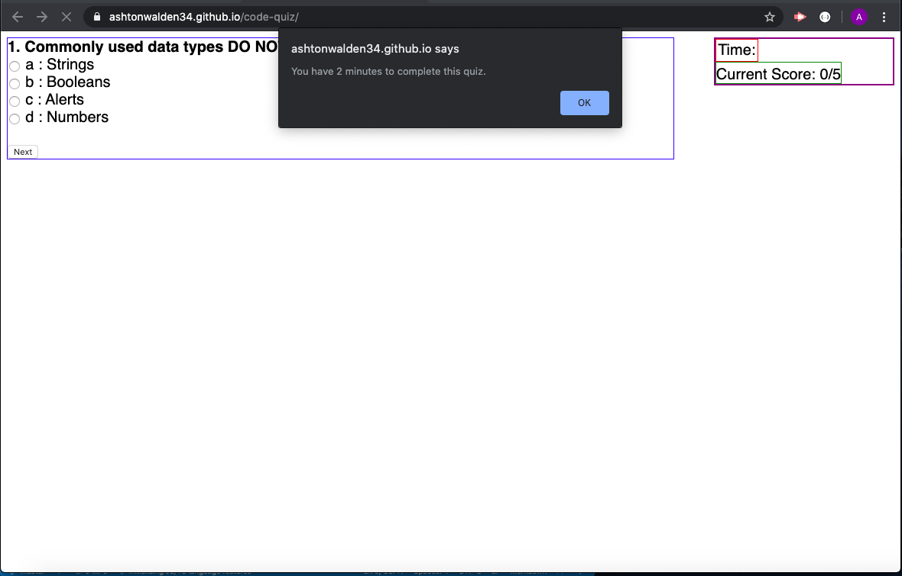
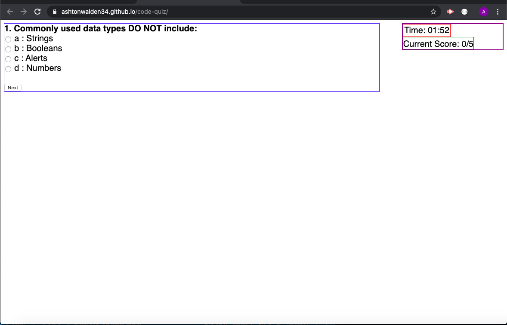
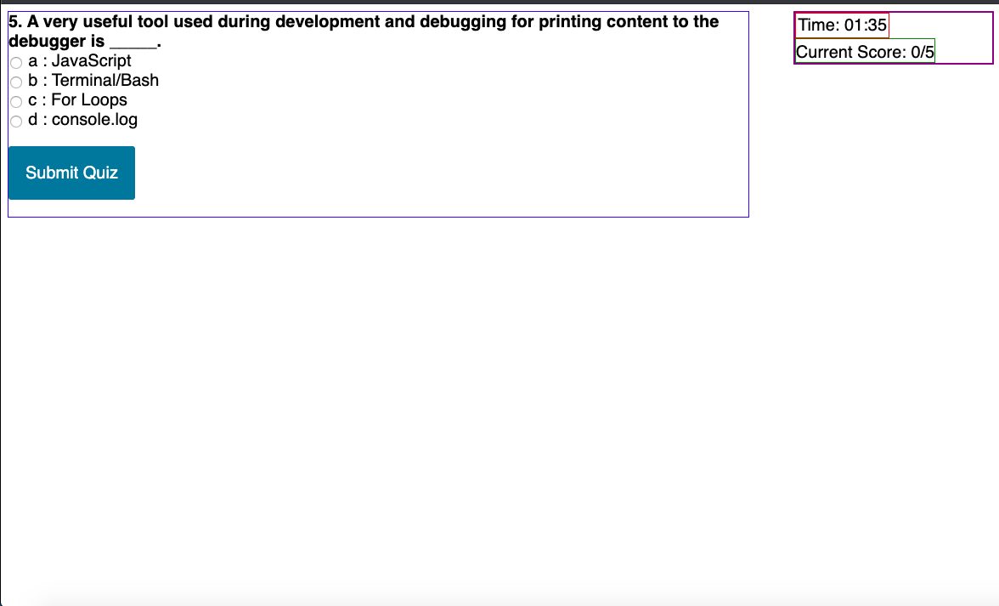
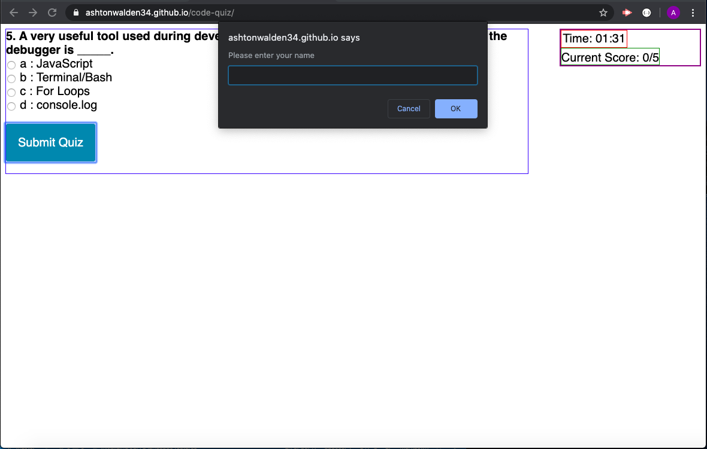
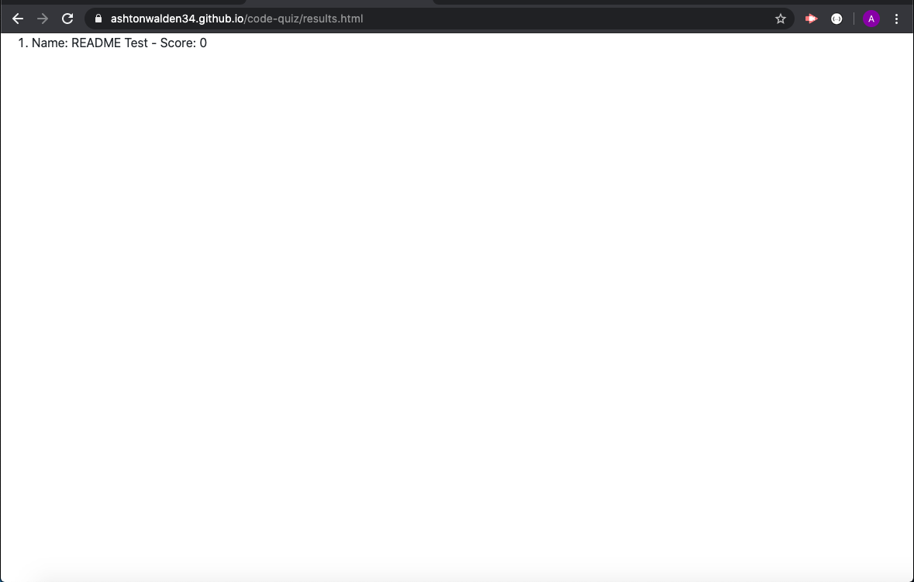

Coding Quiz

Description: This application is a coding quiz that has a two minute time limit. It will prompt the user for their name and store thier scores. 

How to use
    - The application begins by informing the user of the time limit.

    ;

    - The quiz will then begin by starting the timer and showing the first question

    ;
    
    - When the next button is clicked it will advance to the next question, until the fifth and final question is reached, then the submit button will display

    ;

    - The application will then prompt the user to enter their name either when the submit button is clicked or the time runs out.

    ;

    - The application will then display a list of stored scores
    
    ;